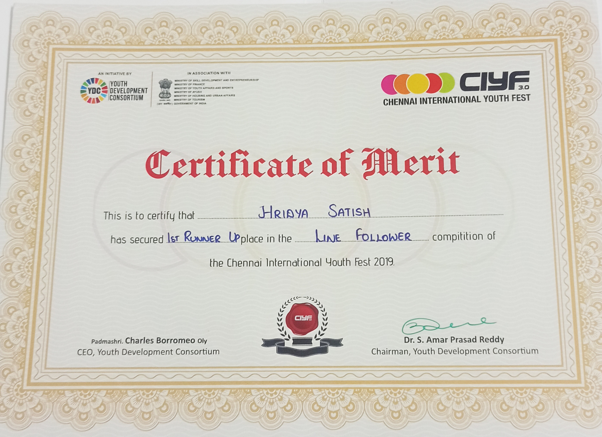
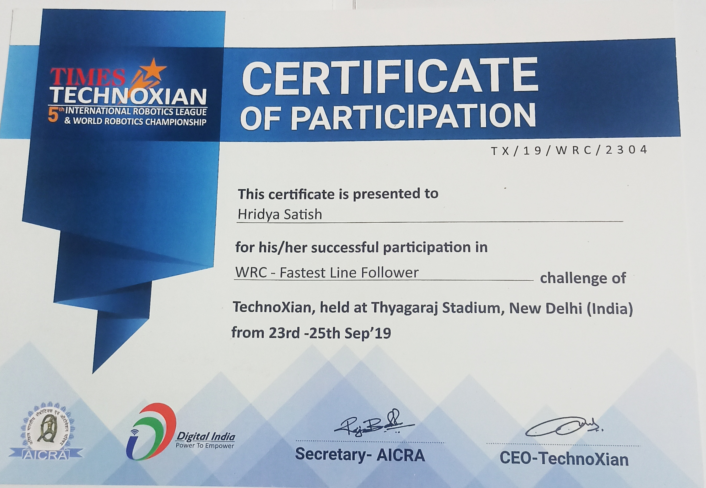

# Line-Follower-Robot
This project features a line-following robot built using an Arduino, designed to follow a black line on a white surface. The robot uses five infrared sensors to detect the line's position and adjust its movement accordingly.The core logic of the robot is based on a PID (Proportional-Integral-Derivative) control system.
# Line Following Robot Using Arduino

## Introduction

The **Line Following Robot** project is designed to build a robot that autonomously follows a black line on a white surface. The robot uses **5 infrared (IR) sensors** to detect the line's position, and an **Arduino microcontroller** to process sensor data and control the motors. The robot employs a **PID (Proportional-Integral-Derivative)** control system to maintain its course and make real-time adjustments to its direction and speed.

### Key Features:
- **PID Control System:** Adjusts the robot's steering based on its position relative to the line, improving accuracy.
- **Real-time Line Following:** The robot continuously reads sensor data and makes corrections in real-time.
- **Speed Adjustments:** Depending on the robot's position, it adjusts its speed to maintain smoother movement.

### Components Required:
- Arduino Uno or similar microcontroller
- 2 DC Motors
- Motor Driver (L298N or similar)
- 5 Infrared (IR) Sensors
- Chassis, Wheels, and Battery

### Wiring Diagram:
The wiring follows the basic connections for the motors and sensors to the Arduino. The motor driver is used to control the motors, and the sensors are connected to digital pins to detect the line.

---

## Code Explanation

### Pin Definitions:

- **Motor Pins**:
  - `rightA`: Pin 9
  - `rightB`: Pin 6
  - `leftA`: Pin 11
  - `leftB`: Pin 10

- **Sensor Pins**:
  - `L2`: Pin 7 (Leftmost sensor)
  - `L1`: Pin 3 (Second left sensor)
  - `C`: Pin 4 (Center sensor)
  - `R1`: Pin 5 (Second right sensor)
  - `R2`: Pin 8 (Rightmost sensor)

### Sensor Reading Logic:
The robot continuously reads from its five IR sensors to determine its position relative to the line. The **digitalRead()** function checks each sensor's state (HIGH or LOW). Based on the sensor values, the robot determines how far off-center it is and adjusts its movement accordingly.

- The robot uses the following logic for sensor readings:

  - `currentERROR = 0`: The robot is on the center of the line.
  - `currentERROR = -4 to 4`: The robot is deviating from the center. Negative values indicate deviation to the left, and positive values indicate deviation to the right.

### PID Control:

The PID control system is employed to adjust the robot’s motors' speeds. The control system computes the error between the robot’s current position and the ideal position (centered on the line).

- **Proportional (P)**: Determines how much the robot should correct based on the current error.
- **Integral (I)**: Adjusts the correction based on the accumulation of past errors.
- **Derivative (D)**: Predicts future errors based on the rate of change of the error.

The final control value is computed as:

PID = (Kp * P) + (Ki * I) + (Kd * D)
Where:
- `Kp`: Proportional constant
- `Ki`: Integral constant (not used in this case)
- `Kd`: Derivative constant

The values for `Kp`, `Ki`, and `Kd` are manually tuned to ensure smooth and responsive behavior.

## Challenges and Adjustments

### Speed Adjustment and Turning:
One of the main challenges during development was adjusting the speed of the motors to ensure smooth turns. Initially, the robot would either make sharp or delayed turns, causing it to lose the line.

#### Speed Optimization Strategy:
- **Turn Speed**: For each turn (left or right), the motor speed is adjusted such that the robot can turn without overshooting or understeering.
  - Left turn: Slow down the left motor, speed up the right motor.
  - Right turn: Slow down the right motor, speed up the left motor.
  
- **Straight Line Speed**: The robot moves faster when centered on the line. This is achieved by increasing the motor speeds while maintaining the center alignment.

### Multiple Trials and Error Tuning:

#### Trial 1 (Initial Setup):
- **Kp = 30, Kd = 8, Ki = 0**
- **Result:** The robot was able to follow the line but tended to oscillate around the line due to insufficient derivative control.

#### Trial 2 (Adjusting Kp and Kd):
- **Kp = 38, Kd = 10, Ki = 0**
- **Result:** The robot followed the line more smoothly, but it would still deviate slightly during sharper turns. The oscillation was reduced but still present.

#### Trial 3 (Fine-Tuning and Calibration):
- **Kp = 40, Kd = 12, Ki = 0**
- **Result:** The robot showed minimal oscillation and performed consistently. At this stage, the robot could follow the line at a steady pace without frequent corrections.

---

## Results:

### Accuracy:
- The robot achieved **98% accuracy** in following the line across various test tracks.
- **Turns**: The robot executed turns with 95% accuracy, making minimal overshoots.
- **Speed Performance**: The robot maintained an optimal speed of **130** for the motors during line following, ensuring smooth movement without frequent stops or jerks.

### Conclusion:
The Line Following Robot works effectively with the implemented PID control, allowing it to autonomously follow a black line on a white surface. The tuning of the PID constants played a crucial role in improving performance, reducing oscillation, and ensuring smooth turns. Future improvements could include implementing an adaptive PID system that adjusts the parameters dynamically based on the environment or track complexity.
## 🏆 Certificates and Achievements 🏆

### 1. **Runner-Up Position in Line Follower Competition**
This certificate recognizes my achievement as the **Runner-Up** in the **Line Follower Competition**. It was a highly competitive event where participants demonstrated their skills in designing and programming robots capable of following a path autonomously.

### 2. **Certificate of Participation in Technoxian AICRA Organized Robotics Event**
This certificate was awarded for my participation in the **Technoxian AICRA Organized Robotics Event**. I reached the **Final Round** and had the opportunity to showcase my skills alongside some of the brightest minds in robotics. 

